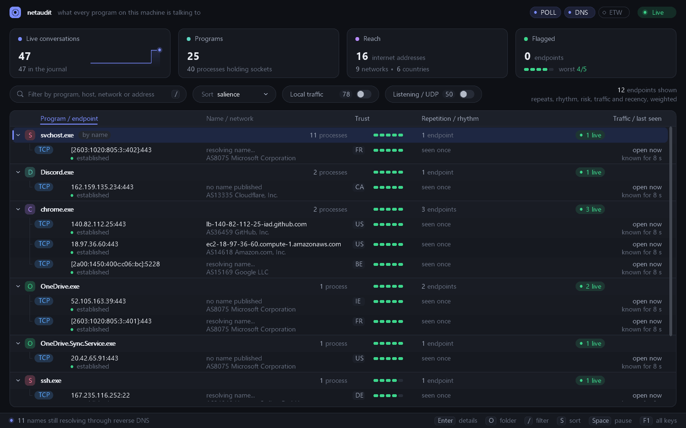

<div align="center">

# 🛰️ netaudit

### What every program on this machine is talking to — one window, in real time

<p align="center">
  <a href="https://axle-lang.dev"></a>
  <a href="https://github.com/Axle-lang/smalt"></a>
</p>
<p align="center">
  
  
  
</p>



<sub>Written by the program itself — <code>--snap</code> draws one frame and puts it in a file.</sub>

<br>

<sub><a href="#the-idea">The idea</a> · <a href="#what-it-can-and-cannot-see">What it sees</a> · <a href="#it-refreshes-every-second-and-still-sits-still">Why it sits still</a> · <a href="#keys">Keys</a> · <a href="#building">Building</a> · <a href="#reading-the-source">Reading the source</a> · <a href="https://github.com/Axle-lang/smalt">smalt ↗</a> · <a href="https://axle-lang.dev">Axle ↗</a></sub>

</div>

---

## The idea

A connection list tells you a machine is talking to two hundred addresses.
That is not an audit; it is a haystack.

What separates one address from another is not volume but **shape**:

- a browser tab opens a burst of connections and stops;
- an update service reconnects every few hours, raggedly, because its timer drifts;
- **a beacon reconnects every thirty seconds, to the millisecond, forever.**

So netaudit is a tree, one row per **program**, folding open onto the addresses
it has been talking to. Every endpoint carries a ring of the instants it came
back, and three readings taken from that ring — the median gap, the wander
around it, and the steadiness that falls out.

The row says its reading in words:

```
×214 visits · every 30 s · clockwork
```

A window just opened has no rhythm to report and says `seen once`. The readings
fill in as the session runs — which is the whole point of a journal that
outlives what is live.

**The trust score is out of five and always explainable.** `Enter` opens a card
listing every signal that applied, with the points it cost or earned. A score
nobody can interrogate will be believed blindly or ignored entirely, and both
are worse than no score.

---

## What it can and cannot see

**There is no URL.** Windows does not record the path of an HTTP request
anywhere a tool can read, and HTTPS would encrypt it even if it did. Getting
one needs a proxy in the middle or a packet capture, and this is neither.

What it answers instead:

| Question | Where the answer comes from | Reading |
|---|---|---|
| which program, which protocol, which address and port | the per-process TCP/UDP tables (`iphlpapi`) | `POLL` |
| which **name** is behind the address | the machine's DNS cache, and reverse DNS | `DNS` |
| who **owns** the address, and where it is | `ip-api.com`, with Team Cymru's DNS whois behind it | `DNS` |
| how many **bytes** moved | a kernel ETW trace | `ETW` |
| the short connections polling misses | the same trace | `ETW` |

Three readings, three badges in the title bar. Each is lit when it is running,
and each explains itself when hovered.

> **`ETW` is declared and not implemented.** Its badge stays dark and the
> traffic column stays blank — and the badge is exactly why that is readable
> rather than misleading. A blank byte column with nothing to explain it says
> *these programs sent nothing*, which is the one thing it must never say.

**Two things are hidden by default**, each with its count on the toggle that
reveals it: traffic that never leaves the building (`L`), and sockets with no
peer — listening and UDP (`B`). Between them they are three quarters of the
rows on a working machine, and not one of them answers the question the window
is asking.

---

## It refreshes every second and still sits still

The machine underneath changes constantly. The window does not move under your
hand. Six rules, applied everywhere:

| | |
|---|---|
| **An endpoint is a journal entry, not a snapshot.** | A closed connection goes grey and stays five minutes after its last socket is gone, counts intact. A table of what is `ESTABLISHED` *right now* would flicker continuously, and would answer the wrong question. |
| **Identity is never an index.** | The selection is an endpoint key, the folds are group keys, the scroll is pixels. A rebuild cannot move any of them. |
| **The sort is damped, and freezes on hover.** | A row only overtakes its neighbour by a margin — and while the pointer is over the tree, nothing reorders at all. |
| **Figures are smoothed.** | A rate carries three quarters of the previous reading. |
| **It repaints on change, not on a clock.** | Idle, it sleeps in the OS. |
| **Enrichment lands quietly.** | A row completes in place; it does not jump. |

---

## Keys

| | |
|---|---|
| `↑` `↓` | move · `PgUp` `PgDn` `Home` `End` move further |
| `→` `←` | open and fold a program · `8` fold everything |
| `Enter` | the full card for the selected endpoint |
| `O` | open the folder holding the program, binary selected |
| `S` | next ranking · `/` filter · clicking **Sort** opens the list of rankings, each with what it weighs |
| `L` | also show local traffic · `B` also show listening and UDP sockets |
| `Space` | pause · `R` re-read now · `C` clear the journal |
| `F12` | write the window to `netaudit.bmp`, in the folder it was started from |
| `F1` | the key list · `Esc` close a card or clear the filter · `Q` quit |

`Esc` never closes the window: a key pressed to dismiss something must not be
able to end the session you were in the middle of.

**The window resizes, and the layout follows.** The cards share the width,
the tree grows to the bottom, and the right-hand column and the badges stay
anchored to the right edge; below 1280 × 640 the frame is cut at the window's
edge rather than every column overlapping. The pointer is a beam over the
filter and a hand over anything that answers a click.

**The column headers rank by what they name**, and the one the rows are ordered
by is underlined. A header covering two readings takes both: `Repetition /
rhythm` ranks by repeat count, then by steadiness. A program ranks by its best
endpoint under the same reading, so the program holding the steadiest timer is
the one at the top of a rhythm-sorted tree.

**A program's triangle folds it; the rest of its row selects it** — so a
program's totals are readable without closing what you were looking at. The
scrollbar drags, and clicking its track jumps there.

**Hovering explains.** A program shows its full image path; an endpoint shows
everything the two lines had to elide; a badge says what that reading is doing,
and why.

---

## Where the names and the networks come from

Two sources. Neither needs a key or an account.

**`ip-api.com/batch`** — up to a hundred addresses per request: AS number and
name, country, city, operator, and the `proxy` / `hosting` / `mobile` flags.
One batch in flight, four and a half seconds apart (the service allows fifteen
batches a minute), exponential back-off on failure, and every address answered
exactly once per session. A batch that never arrived — the network was down, the
service said 429 — puts its addresses back in line; it is not read as "every
one of them came back empty".

**Team Cymru's DNS whois** — `x.y.z.w.origin.asn.cymru.com` and
`AS<n>.asn.cymru.com`, both `TXT`, for the addresses the batch could not name.
Each question is asked once per address, answered or not, so one address the
registry cannot place never holds up the rest.

<details>
<summary><b>Why the second one is DNS and not HTTP</b></summary>

<br>

`std::net`'s HTTP client speaks HTTP/1.1 and **not TLS**, so an `https://`
request from an Axle program cannot succeed. A registry fallback over HTTPS
would have been one that never once answered — and it would have looked
exactly like an address nobody could name. DNS needs no TLS, no key, and no
rate limit worth the name.

For the same reason there is **no blocklist signal** in the score. Every
keyless blocklist service is HTTPS-only, and a trust signal that can never fire
is worse than an absent one: it reads as evidence of innocence.

</details>

---

## Building

smalt is a submodule, so the clone has to bring it:

```bash
git clone --recursive https://github.com/Axle-lang/netaudit
cd netaudit
axle build
./target/netaudit.exe
```

> An existing clone that predates the submodule: `git submodule update --init`.

**The only prerequisite is the Axle compiler, v0.14 or newer.** No SDK to
install, no DLL to copy beside the binary, no `[link]` section to fill in:
every OS library — `iphlpapi`, `dnsapi`, `kernel32`, `shell32`, and `gdi32`
through smalt — is named by the `extern "C" from "…"` block that imports from
it, so the link line learns of each from the declaration that needed it. The
one exception is `NtQuerySystemInformation`, bound by symbol from `ntdll`.

**Nothing needs elevation.** The connection tables, the resolver cache and
the reverse lookups are readable by any process. Run elevated, one thing
improves: the image paths of services running under another account become
readable, so `svchost` and friends are grouped by path rather than by name.
The kernel trace behind the `ETW` badge would need elevation too, and it is
not implemented.

**The resolver cache is read, never queried.** Each cached name is resolved
with `DNS_QUERY_NO_WIRE_QUERY`, so nothing about what this machine looked up
leaves it.

**`--snap <ms>`** waits that long, writes `netaudit.bmp`, and quits: a capture
for a report or for a script, with nobody standing over the machine at the
right moment. `F12` does the same on demand.

---

<div align="center">

## Reading the source

<sub>Everything below is for someone opening the files, not running the binary.</sub>

</div>

### Layout

```
netaudit
├── axle.toml                  the package, the smalt path dependency, the win32 port
├── src/
│   ├── main.axle              the window, the loop, the two lookups in flight
│   ├── session.axle           what the loop owns: the world, the machine, the queue, the app
│   ├── app.axle               the interaction state: selected, sorted, filtered, folded
│   ├── input.axle             keys, clicks and the wheel, turned into changes on `app`
│   ├── theme.axle             the palette and the layout grid
│   ├── fmt.axle               the figures a library cannot format: an address, a rate
│   │
│   ├── sys/                   the machine, as this program reads it
│   │   ├── machine.axle       the four readers, as one value
│   │   ├── raw.axle           the four pointer views the imports need — all the `unsafe`
│   │   ├── tiers.axle         which readings are running, and why the others are not
│   │   ├── shape.axle         the pointer shapes the window asks for
│   │   └── win32/             ← the one directory that names an operating system
│   │       ├── conn.axle      GetExtendedTcp/UdpTable, v4 and v6, one row shape
│   │       ├── procs.axle     process names, and where each binary lives
│   │       ├── dnscache.axle  the resolver's cache, inverted to address → name
│   │       ├── rdns.axle      the PTR record, for what nothing else could name
│   │       ├── shell.axle     explorer.exe /select,"…"
│   │       └── pointer.axle   the beam over a field, the hand over a control
│   │
│   ├── model/                 the journal, and every reading taken off it
│   │   ├── world.axle         the six tables below, as one value
│   │   ├── pool.axle          interned text — nothing here is ever a `string`
│   │   ├── key.axle           the one hash every identity is folded with
│   │   ├── addr.axle          loopback / private / public, and how an address is keyed
│   │   ├── hosts.axle         one row per address: name, network, place, flags
│   │   ├── endpoints.axle     the journal, and the salience the tree ranks by
│   │   ├── rhythm.axle        the arrival ring, and the period and steadiness from it
│   │   ├── groups.axle        one row per program, keyed on the image path
│   │   ├── score.axle         the trust reading, and the nine reasons behind it
│   │   ├── view.axle          the flattened tree: which rows, in what order, how tall
│   │   └── pulse.axle         the four headline cards, sampled once a tick
│   │
│   ├── enrich/                who owns an address, asked over the network
│   │   ├── queue.axle         who gets looked up, how often, and the back-off
│   │   ├── worker.axle        the one blocking call, on a thread of its own
│   │   ├── scan.axle          values out of a JSON response, byte by byte
│   │   ├── ipapi.axle         the batch response, folded into rows
│   │   └── cymru.axle         the registry over DNS, for what the batch could not name
│   │
│   └── ui/                    nothing below here reads the machine
│       ├── paint.axle         the frame, the two faces, the figure cursor
│       ├── parts.axle         the pieces every surface is assembled from
│       ├── card.axle          the cursor a card's content is emitted against, twice
│       ├── chrome.axle        the title bar, the four cards, the toolbar, the status
│       ├── tree.axle          the list itself
│       ├── tooltip.axle       the hover card
│       └── detail.axle        the full endpoint card
│
├── doc/netaudit.png           this page's screenshot, written by `--snap`
└── vendor/smalt               the library, as a submodule
```

**One directory names an operating system, and `axle.toml` says which.**
`[port.win32]` binds `when = { os = "windows" }` to `dirs = ["win32"]`, so
`use crate::sys::conn::Conns` resolves to `sys/win32/conn.axle` on Windows and
would resolve to a sibling directory's file on another target.

Everything above `sys/` — the model, the enrichment, the whole UI — names no OS
at all. That is what makes a second port six files and no edit anywhere else.
`axle ports` prints the table with a tick per seam.

### What it stands on

Everything below the audit is [smalt](https://github.com/Axle-lang/smalt): the
window, the surface, the event queue, the clipped 2-D primitives with their
rounded corners and anti-aliased text, the two baked faces, the byte pool, the
slot index, the formatter and the BMP writer. Four of them are worth naming.

**The frame is a view, not an owner.** `Surface::frame()` hands back an address
and a clip, never the colour buffer as an array — so the shape that double-frees
is not writable. An `i32[]` field over a borrowed plane gives one allocation two
owners, and the second release is a fault on exit, after everything has been
drawn and flushed.

**The loop sleeps in the OS.** `Events::wait` blocks until an event arrives or
the next reading is due. Idle and paused, this program uses no measurable CPU at
all — which a poll-and-sleep loop cannot say, whatever the sleep, and which a
tool that measures the machine owes it.

**Text is drawn from bytes.** `Scratch` writes a figure into a block and
`BitmapFont::drawBytes` renders straight from it, so a repaint drawing a few
hundred numbers allocates nothing at all.

**Text on screen is ASCII, text handed back to Windows is not.** The baked
face carries codes 32 to 126 and draws anything else as nothing, so a name is
folded on its way into the pool — `Zürich` lands as `Zurich`, not `Z??rich` —
and every literal the program draws is ASCII (a minus sign typed as U+2212
would turn a penalty on the score card into a bonus). The path `O` hands to
`ShellExecuteW` is the UTF-16 Windows gave, kept beside the drawable copy, so a
folder with an accent in its name still opens.

What stays here is what a library cannot know: an address in its canonical text
form, a rate whose empty case means *nothing measured bytes* rather than
*nothing was sent*, the fold the identity indexes are keyed on, and the band a
reading's trace is drawn against.

### How it is written

Four habits, each turning a class of silent mistake into a compile error or a
signature that says what it touches.

**No function takes more than five parameters.** What travels together is one
value: `Session` is what the loop owns, `World` the six model tables,
`Machine` the four OS readers, `Paint` how the window draws, `Layout` where
everything sits for the window's size, `Lens` what the reader asked the tree
to show, and `Sighting`, `Obj`, `Bytes`, `Lane`, `Toggle` and `Band` are the
small values a socket, a JSON object, a span of text, a column, a toolbar
switch and a trace's scale are.
Axle's borrows are second-class (E0513 — a reference lent for a call cannot be
kept in a field), so a surface takes the paint *and* the session, side by side,
rather than a context that pretends to hold both. The four Win32 imports keep
their six arguments: those signatures are Windows's, not ours.

**Every state is an enum, read by a `match` with no wildcard** — `Tier`,
`TierState`, `Sort`, `RowKind`, `Modal`, `Say`, `Action`, `Proto`,
`SocketKind`, `Reach`, `Look`, `NameSource`, `PathState`, `WhoisKind`,
`Reason`. The columns included: they are `Reach[]` and `Look[]`, not `i32[]`.
The wildcards left are on integers (a TCP state number, an index into a cycle),
on smalt's `EventKind`, whose other kinds this window does not answer, and on
`Hot` where the tooltip picks out the three tier badges from fifteen targets.

The event loop is two of those matches — one routes an `EventKind` to a
handler, one applies the `Action` it answered — so an event kind or an action
added later is an error, not a silent no-op. The trust score reads the same
nine-arm table the detail card lists, so a signal cannot be scored without
being explained.

**A lookup that can fail answers two values, never a sentinel.** `tierAt` and
`headerAt` return `(bool, T)`. An integer that is sometimes a `Sort` and
sometimes `-1` is a type nobody reads the same way twice.

**All the `unsafe` is in one file.** `src/sys/raw.axle` holds the four views
between an address and a `ptr` that the Windows imports need; smalt owns the raw
reads and writes. `unsafe` is per-function in Axle (E0707 — it does not
propagate across a call), so that confinement is enforceable rather than
aspirational: `grep -rlE "unsafe (fn|\{)" src/` returns one file.

---

<div align="center">
<sub>MIT — see <a href="LICENSE">LICENSE</a>.</sub>
</div>
